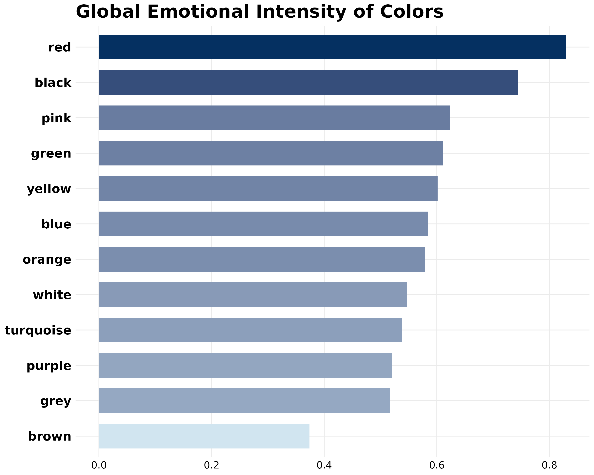
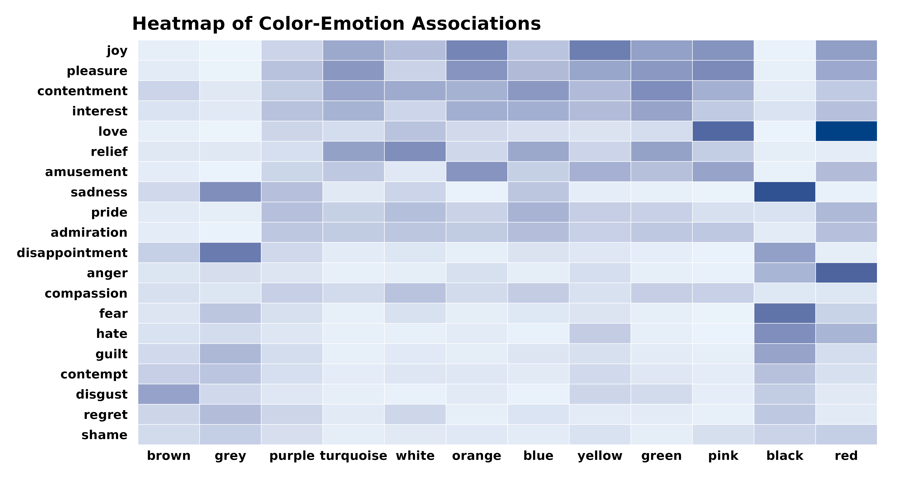
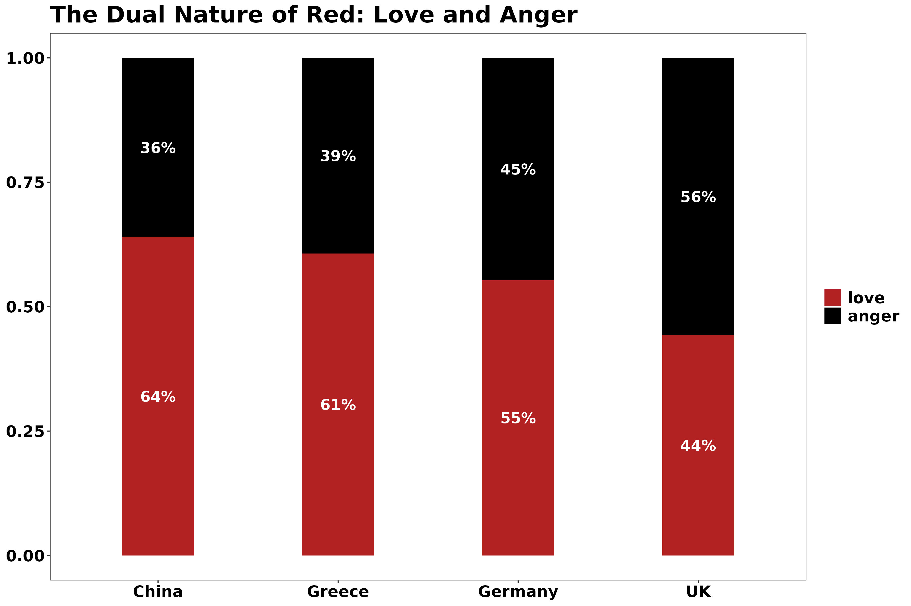
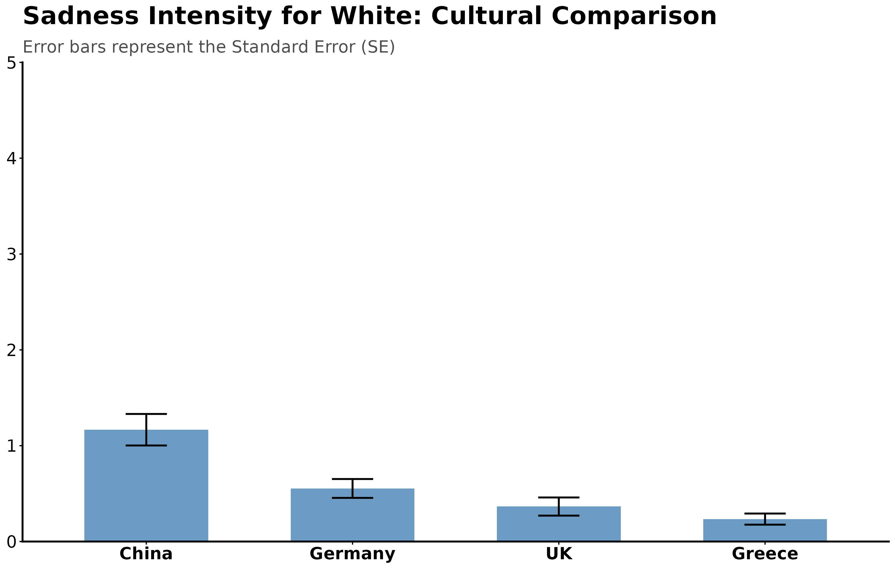
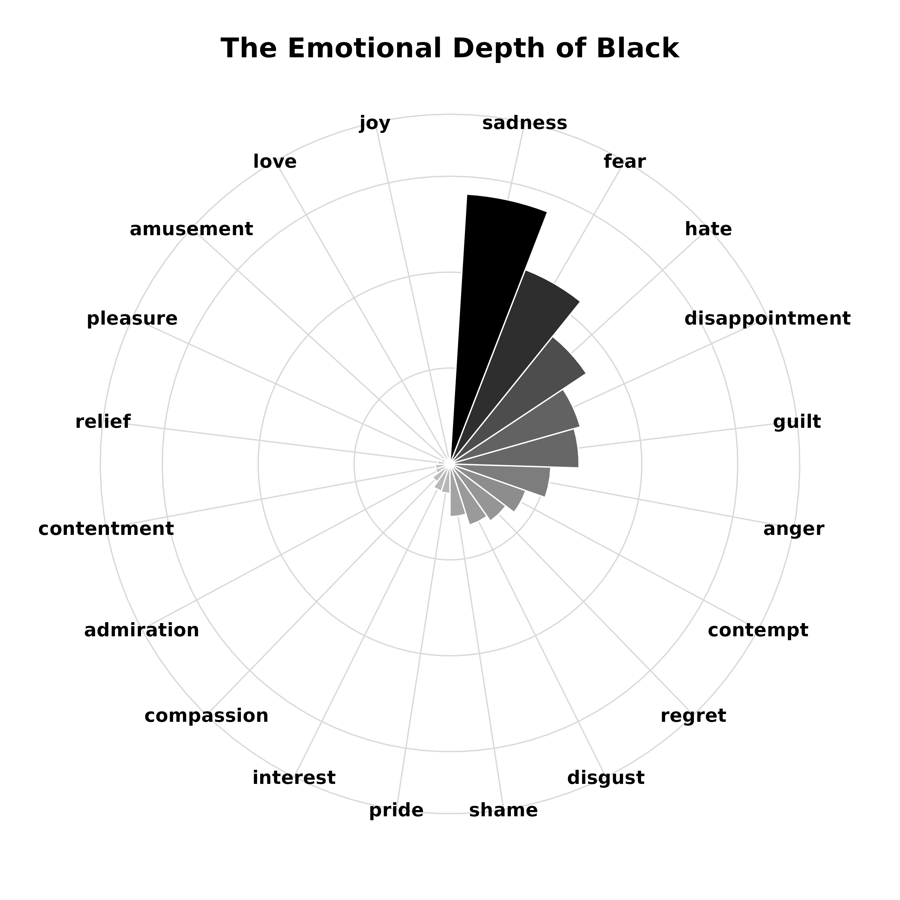

# The Universal Language of Colors 🌍🎨

**Author:** Hilal Selen Bütün  
**Course:** Data Visualization  
**Methodology:** Data visualization and analysis using R (ggplot2).

---

## 📖 Project Description
This project is a **reproducible analysis and visualization** based on the open dataset provided by the scientific study: *"A machine learning approach to quantify the specificity of colour–emotion associations"* (Jonauskaite et al., 2019). 

The aim is to explore whether color-emotion associations are universal or cultural by visualizing the original dataset using R.

---

## 📢 Poster Presentation
Click the link below to view or download the high-resolution academic poster:
### 📄 [Download Poster (PDF)](Poster.pdf)

---

### 📂 Repository Contents

This repository is organized to provide both the visual outputs and the reproducibility of the analysis.

#### 1. /Code
* **Color_Analysis.Rmd:** The complete R Markdown file containing all data cleaning, processing, and visualization codes. This file ensures the analysis is fully reproducible.

#### 2. /Data
* **color.csv:** The raw dataset used for this project (Color-Emotion Association Data).

#### 3. /Plots
High-resolution visual outputs generated from the analysis:
* **Global Intensity:** Analysis of how intensely colors are felt globally.
* **Heatmap:** Correlation matrix of color-emotion pairs.
* **Red Analysis:** The dual nature of Red (Love vs. Anger) across cultures.
* **White Analysis:** Cultural differences in the perception of White (Sadness).
* **Black Radar:** Multidimensional analysis of the emotions associated with Black.

---

### 📊 Key Visualizations

Here is a preview of the main charts generated in this project:

#### 1. Global Color-Emotion Intensity

#### 2. Correlation Heatmap

#### 3. The Dual Nature of Red: Love & Anger

#### 4. Cultural Nuance: White & Sadness

#### 5. Radar Analysis: Black

---

### 🔗 Reference
> Jonauskaite, D., Wicker, J., Mohr, C., Dael, N., Havelka, J., Papadatou-Pastou, M., Zhang, M., & Oberfeld, D. (2019). A machine learning approach to quantify the specificity of colour–emotion associations and their cultural differences. *Royal Society Open Science*, 6(9), 190741. [Access Article](https://royalsocietypublishing.org/doi/10.1098/rsos.190741)
